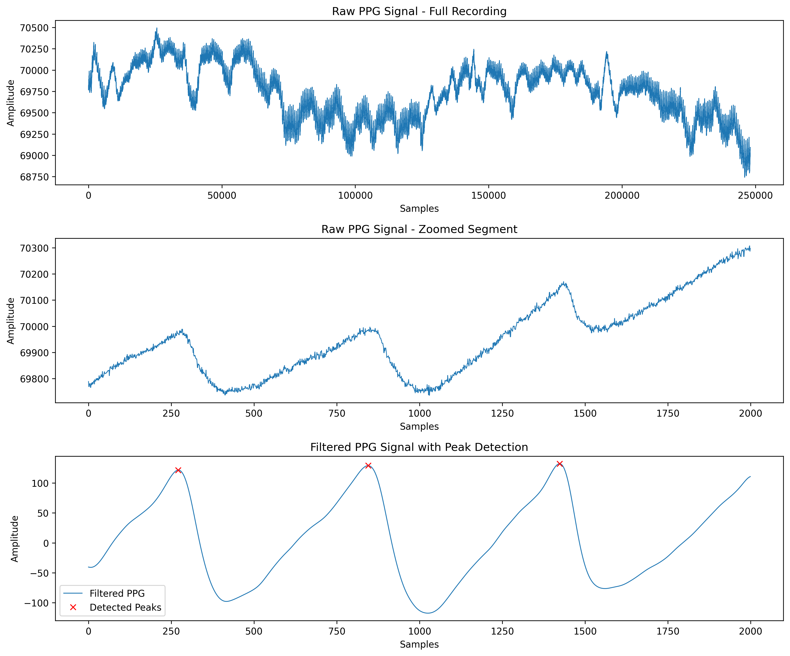
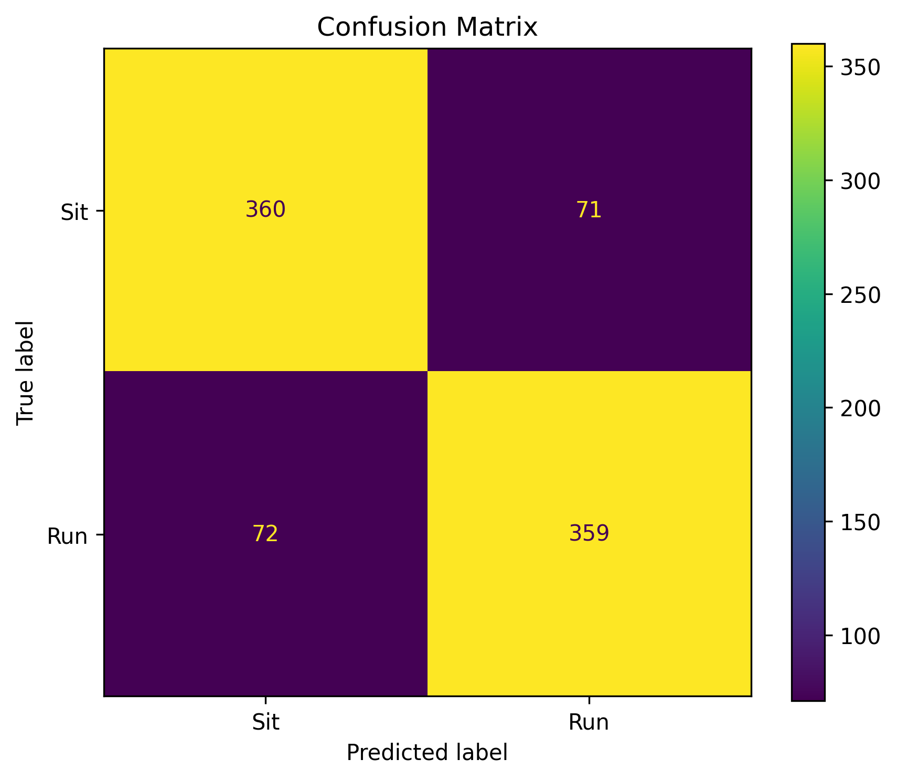
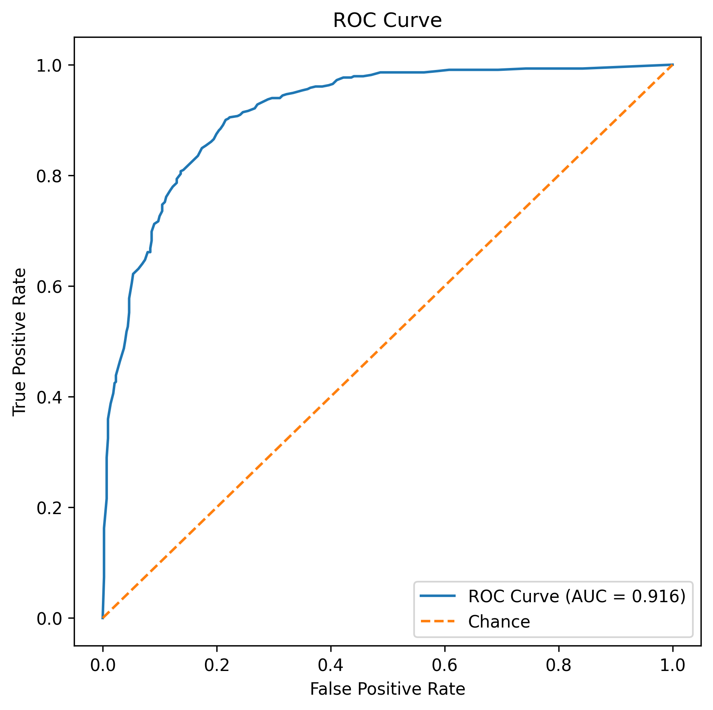
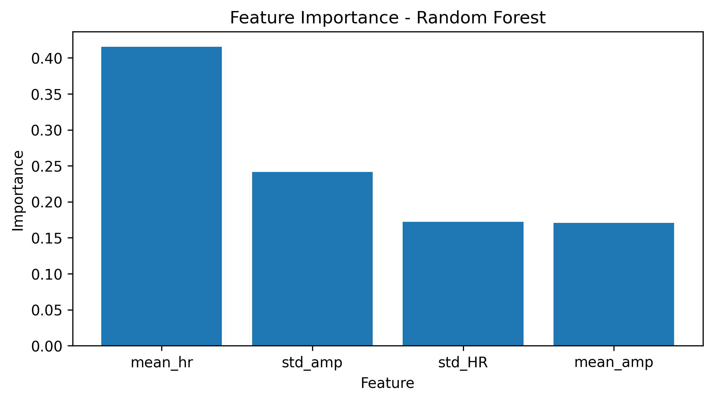

# Classification of Physiological States Using PPG Signal Features and Machine Learning

A biomedical signal-processing and machine-learning project for classifying resting and active physiological states from photoplethysmography (PPG) signals.

## Overview

This project investigates whether physiological features extracted from PPG signals can distinguish between resting and active states.

The project initially explored blood pressure estimation from PPG. Due to limitations in the available continuous blood-pressure data, the objective was refined to a binary classification problem distinguishing **sitting (rest)** from **running (active)** conditions.

The final pipeline combines PPG signal preprocessing, pulse-peak detection, feature extraction, signal segmentation, and supervised machine learning using a Random Forest classifier.

## Dataset

Data were obtained from the **PhysioNet Pulse Transit Time PPG Database**.

The database contains physiological recordings from approximately 22 subjects collected under three activity conditions:

- Sitting
- Walking
- Running

For this project, only **sitting and running recordings** were used, resulting in **44 recordings** representing the two physiological states.

The `pleth_1` PPG channel was selected for signal analysis. Raw PhysioNet waveform files are not included in this repository.

## Signal Processing Pipeline

The PPG signals were processed using the following pipeline:

1. **PPG channel extraction** — the `pleth_1` channel was extracted from each WFDB recording.
2. **Bandpass filtering (0.5–5 Hz)** — used to reduce baseline drift and high-frequency noise while retaining cardiac-related signal components.
3. **Segmentation** — each recording was divided into **5-second non-overlapping windows**.
4. **Peak detection** — pulse peaks were identified within each segment using `scipy.signal.find_peaks`.
5. **Feature extraction** — heart-rate and pulse-amplitude characteristics were calculated for each valid segment.

## Extracted Features

Four time-domain PPG features were extracted from each segment:

- **Mean heart rate (`mean_hr`)** — average heart rate estimated from pulse-to-pulse intervals.
- **Heart rate variability (`std_HR`)** — standard deviation of estimated heart rate within the segment.
- **Mean pulse amplitude (`mean_amp`)** — average amplitude of detected PPG peaks.
- **Pulse amplitude variability (`std_amp`)** — standard deviation of detected peak amplitudes.

After segmentation and feature extraction, the final dataset contained **4,307 feature vectors**:

- **2,152 sitting samples**
- **2,155 running samples**

This resulted in a nearly balanced binary classification dataset.

## Machine Learning

A **Random Forest Classifier** was used to distinguish between:

- `0` — Sitting / Rest
- `1` — Running / Active

The segmented dataset was divided using a stratified **80/20 train-test split** with a fixed random seed for reproducibility.

The final split contained:

- **3,445 training samples**
- **862 testing samples**

## Results

The Random Forest classifier achieved the following window-level performance:

| Metric | Performance |
|---|---:|
| Accuracy | **83.4%** |
| F1 Score | **0.83** |
| ROC-AUC | **0.916** |
| Test Samples | **862** |

Performance was highly balanced between the two classes. Both sitting and running achieved an F1-score of approximately 0.83.

### Confusion Matrix

The model correctly classified 360 of 431 sitting windows and 359 of 431 running windows.

### ROC Curve

The model achieved a ROC-AUC of approximately **0.916**, indicating strong discrimination between sitting and running windows across classification thresholds.

## Feature Importance

Random Forest feature importance was used to examine the relative contribution of the four PPG-derived features to classification.

## Project Workflow

**PPG Recording → `pleth_1` Extraction → Bandpass Filtering → 5-s Window Segmentation → Peak Detection → Feature Extraction → Random Forest → Sit/Run Classification**

## Tools and Libraries

- Python
- NumPy
- pandas
- SciPy
- WFDB
- scikit-learn
- Matplotlib
- PhysioNet

## Reproducibility

The analysis notebook contains the complete signal-processing and machine-learning pipeline used in this project.

Raw PhysioNet waveform data are not stored in this repository. The required `.hea` and `.dat` files should be obtained from the original PhysioNet dataset before running the analysis.

A fixed `random_state` and stratified train-test split are used to make the window-level machine-learning evaluation reproducible.

## Limitations

Although segmentation increased the number of machine-learning samples, the **4,307 samples represent signal windows rather than 4,307 independent subjects**. Multiple windows originate from the same physiological recordings.

The current 80/20 evaluation is therefore a **window-level split**. Windows originating from the same recording may occur in both the training and test sets, meaning the reported performance should not be interpreted as subject-independent generalization.

The dataset also contains a relatively small number of subjects, and the current model uses only four time-domain PPG features.

## Future Work

Future improvements include:

- Subject-level train/test splitting or GroupKFold cross-validation
- Evaluation on completely unseen subjects
- Additional temporal and morphological PPG features
- Motion-artifact quality assessment
- Comparison with additional machine-learning models
- Evaluation on larger and more diverse PPG datasets
- Exploration of deep-learning approaches for raw waveform classification

## Author

**Manjula Adiveppa Wader**  
M.S. Biomedical Data Analytics  
University of Southern California
